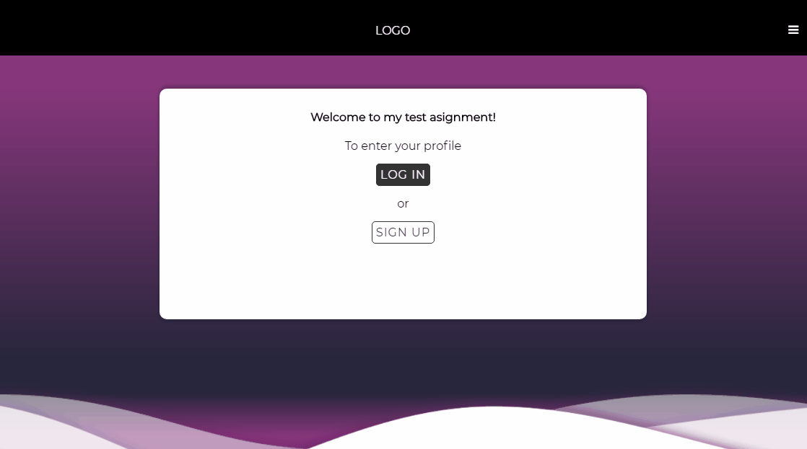

# MERN Stack App - [login-signup-test.herokuapp.com](https://login-signup-test.herokuapp.com/)

### Front-End - React + Redux
### Back-End - Node.js, Express.js & MongoDB

#### Steps to run in development mode:

1. Clone the repo or download a [zip](https://github.com/GlobalSiteDev/LogIn-SignUp/archive/master.zip).
3. Make sure you have [Node.js](https://nodejs.org/en/) & [MongoDB](https://www.mongodb.com/) installed in your system.
4. Run (from the root) `npm install` and `cd client && npm install` to download dependencies.
5. Start [MongoDB](https://docs.mongodb.com/manual/administration/install-community/) service.
6. `cd .. && npm run dev` to start server and client concurrently.
